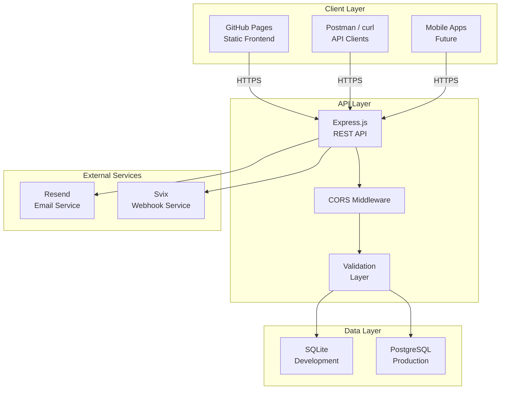

# MedMatch API Documentation

Interactive API documentation for the MedMatch job matching platform connecting medical professionals with employers.

## Quick Start (5 Minutes to First API Call)

Get up and running with the MedMatch API in under 5 minutes:

### 1. Start the API Server (2 minutes)

```bash
# Clone the repository
git clone https://github.com/explofish/medmatch.git
cd medmatch/mock-api

# Install dependencies
npm install

# Start the server
npm start
```

The API will be running at `http://localhost:3000`

### 2. Make Your First API Call (1 minute)

```bash
# Health check - verify the API is running
curl http://localhost:3000/api/health
```

Expected response:
```json
{
  "status": "ok",
  "timestamp": "2024-01-15T10:30:00.000Z",
  "service": "medmatch-api"
}
```

### 3. Create Your First Candidate (2 minutes)

```bash
# Create a candidate profile
curl -X POST http://localhost:3000/api/candidates \
  -H "Content-Type: application/json" \
  -d '{
    "email": "doctor@example.com",
    "firstName": "John",
    "lastName": "Doe",
    "location": "Berlin",
    "specialty": "Kardiologie",
    "experienceYears": 5
  }'
```

Expected response:
```json
{
  "message": "Candidate created successfully",
  "data": {
    "id": 1,
    "email": "doctor@example.com",
    "firstName": "John",
    "lastName": "Doe",
    "location": "Berlin",
    "specialty": "Kardiologie",
    "experienceYears": 5,
    "createdAt": "2024-01-15T10:30:00.000Z"
  }
}
```

🎉 **Done!** You've made your first successful API call.

### Next Steps

- Explore all endpoints with [Swagger UI](https://explofish.github.io/medmatch/api-docs/)
- Import the [Postman Collection](postman-collection.json)
- Read the full [Developer Guide](../mock-api/API_DOCUMENTATION.md)

---

## Architecture

### System Overview



### Data Flow

1. **Signup Flow**: Candidate fills form → Frontend POSTs to `/api/auth/register` → Data saved to SQLite
2. **Matching Flow**: Candidate requests matches → GET `/api/matches?candidateId=xxx` → Algorithm calculates scores → Returns ranked jobs
3. **Job Management**: Employer creates job → POST `/api/jobs` → Job stored → Available for matching

### Database Schema

```
┌─────────────────┐     ┌─────────────────┐     ┌─────────────────┐
│    signups      │     │   candidates    │     │   employers     │
├─────────────────┤     ├─────────────────┤     ├─────────────────┤
│ id (PK)         │     │ id (PK)         │     │ id (PK)         │
│ email (unique)  │     │ email (unique)  │     │ name            │
│ firstName       │     │ firstName       │     │ description     │
│ lastName        │     │ lastName        │     │ location        │
│ yearOfGrad      │     │ location        │     │ website         │
│ specialization  │     │ specialty       │     │ hospitalType    │
│ state           │     │ experienceYears │     │ size            │
│ createdAt       │     │ cvUrl           │     │ isDeleted       │
└─────────────────┘     │ preferences     │     │ createdAt       │
                        │ isDeleted       │     │ updatedAt       │
                        │ createdAt       │     └─────────────────┘
                        │ updatedAt       │              │
                        └─────────────────┘              │
                                 │                       │
                                 └──────────┬────────────┘
                                            │
                                            ▼
                                   ┌─────────────────┐
                                   │      jobs       │
                                   ├─────────────────┤
                                   │ id (PK)         │
                                   │ employerId (FK) │
                                   │ title           │
                                   │ specialty       │
                                   │ location        │
                                   │ description     │
                                   │ requirements    │
                                   │ salaryMin       │
                                   │ salaryMax       │
                                   │ jobType         │
                                   │ experienceReq   │
                                   │ status          │
                                   │ postedAt        │
                                   └─────────────────┘
```

---

## Environment Variables

### Required Variables

| Variable | Description | Default | Required |
|----------|-------------|---------|----------|
| `PORT` | HTTP server port | `3000` | No |
| `NODE_ENV` | Environment mode (`development`, `production`) | `development` | No |

### Database Variables

| Variable | Description | Default | Required |
|----------|-------------|---------|----------|
| `DB_PATH` | SQLite database file path | `.data/medmatch.db` | No |
| `TEST_DB_PATH` | Test database path (for CI) | - | No (tests only) |

### External Service Variables

| Variable | Description | Required For |
|----------|-------------|--------------|
| `RESEND_API_KEY` | Resend email API key | Email notifications |
| `SVIX_API_KEY` | Svix webhook API key | Webhook delivery |
| `SVIX_ENDPOINT_ID` | Svix endpoint ID | Webhook delivery |

### CORS Variables

| Variable | Description | Default |
|----------|-------------|---------|
| `CORS_ORIGIN` | Allowed CORS origin | `*` (all origins) |
| `CORS_METHODS` | Allowed HTTP methods | `GET,POST,PATCH,DELETE,OPTIONS` |

### Security Variables (Production)

| Variable | Description | Required In Production |
|----------|-------------|------------------------|
| `JWT_SECRET` | JWT signing secret | Yes |
| `JWT_EXPIRES_IN` | JWT expiration time | `24h` |
| `API_KEY_HEADER` | API key header name | `X-API-Key` |
| `RATE_LIMIT_WINDOW` | Rate limit window (ms) | `900000` (15 min) |
| `RATE_LIMIT_MAX` | Max requests per window | `100` |

### Example .env File

```bash
# Server
PORT=3000
NODE_ENV=development

# Database
DB_PATH=.data/medmatch.db

# External Services (optional for development)
RESEND_API_KEY=your_resend_key_here
SVIX_API_KEY=your_svix_key_here
SVIX_ENDPOINT_ID=your_endpoint_id

# CORS
CORS_ORIGIN=*

# Security (required in production)
JWT_SECRET=your-super-secret-jwt-key-min-32-chars
JWT_EXPIRES_IN=24h
```

---

## Deployment Guide

### Option 1: Glitch (Quickest - 2 minutes)

**Best for**: Quick demos, prototypes, testing

1. Go to [glitch.com](https://glitch.com)
2. Click **New Project** → **hello-express**
3. Upload `server.js` and `package.json` from `mock-api/`
4. Your API is live at `https://your-project.glitch.me`

**Features**:
- ✅ Free tier available
- ✅ Persistent SQLite storage
- ✅ Automatic HTTPS
- ✅ Live reload on file changes

**Detailed Guide**: [GLITCH_DEPLOY.md](../mock-api/GLITCH_DEPLOY.md)

### Option 2: Render (Recommended for Staging)

**Best for**: Staging environments, persistent hosting

1. Go to [render.com](https://render.com)
2. Create account with GitHub
3. **New Web Service** → Connect your repo
4. Configure:
   - Root Directory: `mock-api`
   - Build Command: `npm install`
   - Start Command: `npm start`
5. Click **Create Web Service**

**Features**:
- ✅ Free tier with automatic sleep
- ✅ Custom domains
- ✅ Environment variables
- ✅ Persistent disk available

### Option 3: Railway (Alternative)

**Best for**: Persistent storage, team collaboration

1. Go to [railway.app](https://railway.app)
2. **New Project** → Deploy from GitHub
3. Select repository
4. Set root directory: `mock-api`
5. Deploy

### Option 4: Docker (Production-Ready)

```dockerfile
# Dockerfile
FROM node:18-alpine

WORKDIR /app

COPY package*.json ./
RUN npm ci --only=production

COPY . .

EXPOSE 3000

CMD ["npm", "start"]
```

Build and run:
```bash
docker build -t medmatch-api .
docker run -p 3000:3000 -v $(pwd)/.data:/app/.data medmatch-api
```

### Production Checklist

Before deploying to production:

- [ ] Set `NODE_ENV=production`
- [ ] Configure JWT_SECRET (strong, random, 32+ chars)
- [ ] Set up PostgreSQL instead of SQLite
- [ ] Configure rate limiting
- [ ] Enable CORS for specific origins only
- [ ] Set up monitoring (health checks)
- [ ] Configure log aggregation
- [ ] Set up backup strategy for database

---

## Contributing Guide

### Getting Started

1. **Fork and Clone**
   ```bash
   git clone https://github.com/explofish/medmatch.git
   cd medmatch
   ```

2. **Install Dependencies**
   ```bash
   cd mock-api
   npm install
   ```

3. **Run Tests**
   ```bash
   npm test
   ```

4. **Start Development Server**
   ```bash
   npm run dev
   # or
   npm start
   ```

### Code Style

- Use **JSDoc** comments for all public functions
- Follow **ESLint** rules (run `npm run lint`)
- Use **async/await** for asynchronous code
- Handle errors with try/catch blocks

### Adding New Endpoints

1. Add route handler in `server.js`
2. Add tests in `server.test.js`
3. Update OpenAPI spec in `api-docs/openapi.yaml`
4. Update API documentation in `API_DOCUMENTATION.md`
5. Run tests: `npm test`

### Testing

```bash
# Run all tests
npm test

# Run tests in watch mode
npm run test:watch

# Run with coverage
npm run test:coverage
```

### Submitting Changes

1. Create a feature branch
2. Make your changes
3. Add/update tests
4. Update documentation
5. Run full test suite
6. Submit PR with description

### Documentation Standards

- Keep API examples up-to-date
- Use valid JSON in all examples
- Test all curl examples before committing
- Update both OpenAPI spec and README

---

## API Overview

### Interactive Documentation

Visit the interactive documentation at:  
**https://explofish.github.io/medmatch/api-docs/**

### Resources

| Resource | Description | Link |
|----------|-------------|------|
| **Interactive Docs** | Swagger UI documentation | [View](/medmatch/api-docs/) |
| **OpenAPI Spec** | Complete API specification (YAML) | [Download](openapi.yaml) |
| **Postman Collection** | Ready-to-import Postman collection | [Download](postman-collection.json) |
| **Developer Guide** | Detailed API usage guide | [View](../mock-api/API_DOCUMENTATION.md) |
| **API Usage Guide** | Integration examples | [View](../mock-api/API_USAGE_GUIDE.md) |

### API Base URLs

| Environment | URL |
|-------------|-----|
| Local | `http://localhost:3000` |
| Glitch | `https://your-project.glitch.me` |
| Staging | `https://api-staging.medmatch.de` |
| Production | `https://api.medmatch.de` |

### Main Endpoints

#### Health
- `GET /api/health` - Health check

#### Authentication
- `POST /api/auth/register` - Register new candidate on waitlist

#### Candidates
- `GET /api/candidates` - List candidates with pagination, filtering
- `GET /api/candidates/:id` - Get candidate by ID
- `POST /api/candidates` - Create candidate profile
- `PATCH /api/candidates/:id` - Update candidate (partial)
- `DELETE /api/candidates/:id` - Soft delete candidate

#### Employers
- `GET /api/employers` - List employers
- `GET /api/employers/:id` - Get employer with jobs
- `POST /api/employers` - Create employer profile
- `PATCH /api/employers/:id` - Update employer

#### Jobs
- `GET /api/jobs` - List jobs with filters, pagination
- `GET /api/jobs/:id` - Get job by ID
- `POST /api/jobs` - Create job posting
- `PATCH /api/jobs/:id` - Update job
- `DELETE /api/jobs/:id` - Soft delete job

#### Matching
- `GET /api/matches?candidateId=xxx` - Get ranked job matches
- Matching algorithm scores jobs based on specialty (40%), location (25%), experience (20%), salary (15%)

#### Development
- `POST /api/seed` - Seed sample data (development only)

### Authentication

**Current State**: API operates in development mode without authentication.

**Production**: JWT-based authentication will be implemented before production launch.

```bash
# Future authentication (not yet implemented)
Authorization: Bearer <jwt-token>
```

---

## Development

The documentation is built with [Swagger UI](https://swagger.io/tools/swagger-ui/) and served as static HTML. It's automatically deployed to GitHub Pages.

### Local Documentation Development

```bash
cd api-docs

# Serve with any static file server
npx serve .

# Or with Python
python3 -m http.server 8080
```

Then open http://localhost:8080

### Updating OpenAPI Spec

1. Edit `openapi.yaml`
2. Validate with Swagger Editor: https://editor.swagger.io/
3. Test locally with Swagger UI
4. Commit and push

---

## License

MIT License - see main repository for details.

---

## Support

- **API Issues**: Open an issue on GitHub
- **Documentation**: Contact the CTO team
- **Urgent**: Email api@medmatch.de
